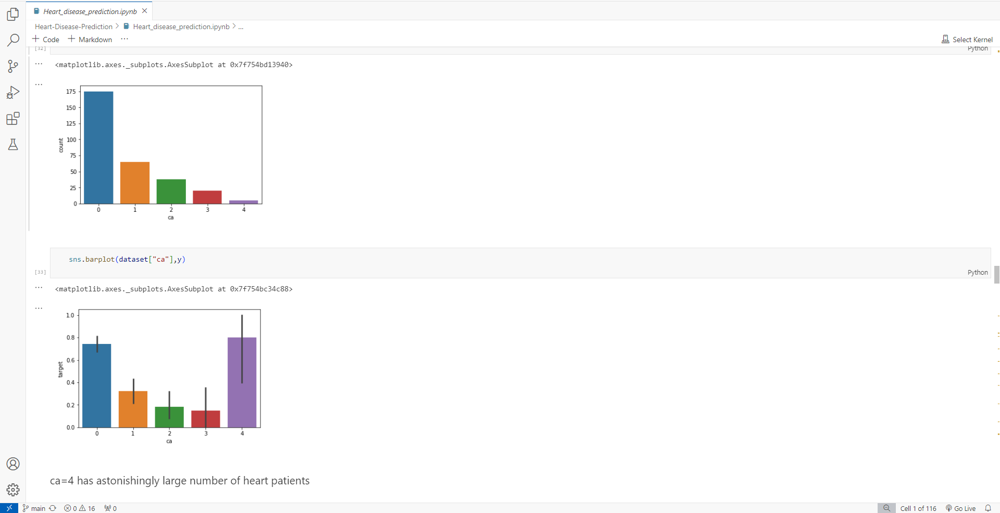
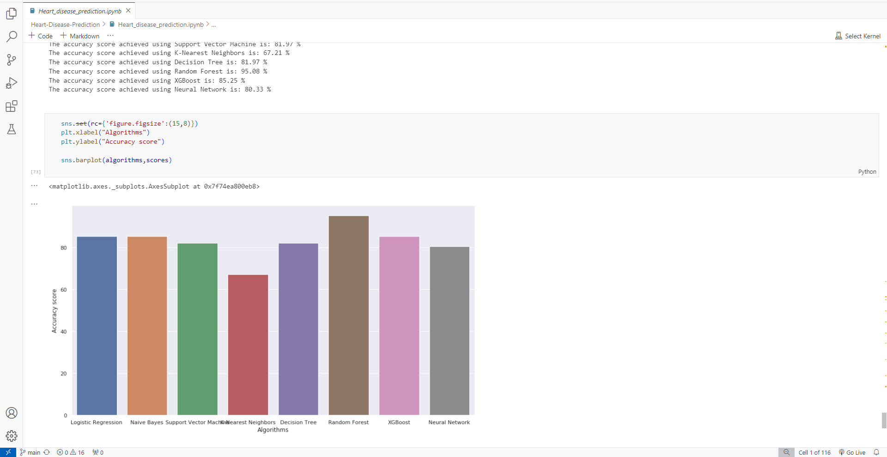

# Heart Disease Prediction using Machine Learning

This project uses Machine Learning to predict the presence of heart disease in patients, leveraging various algorithms for accurate predictions.

## Description

The project involves analyzing a heart disease patient dataset, performing data processing, and training multiple machine learning models to predict heart disease. The models used include:

- Logistic Regression (Scikit-learn)
- Naive Bayes (Scikit-learn)
- Support Vector Machine (Linear) (Scikit-learn)
- K-Nearest Neighbours (Scikit-learn)
- Decision Tree (Scikit-learn)
- Random Forest (Scikit-learn)
- XGBoost (Scikit-learn)
- Artificial Neural Network with 1 Hidden layer (Keras)

## Features

- **Data Processing**: Cleaning and preprocessing the dataset for model training.
- **Model Training**: Training various machine learning models.
- **Prediction**: Making predictions based on trained models.
- **Evaluation**: Evaluating model performance and accuracy.

## Usage

1. **Clone the repository**:
    ```bash
    git clone https://github.com/AdiMo04/Heart-Disease-Prediction-using-Machine-Learning.git
    cd Heart-Disease-Prediction-using-Machine-Learning
    ```

2. **Install dependencies**:
    ```bash
    pip install -r requirements.txt
    ```

3. **Run the Jupyter notebook**:
    ```bash
    jupyter notebook Heart_Disease_Prediction.ipynb
    ```

## Results

- **Accuracy**: Achieved 95% accuracy using Random Forest.

## Dataset

The dataset used for this project is sourced from Kaggle: [Heart Disease UCI Dataset](https://www.kaggle.com/ronitf/heart-disease-uci).

## Snippets




